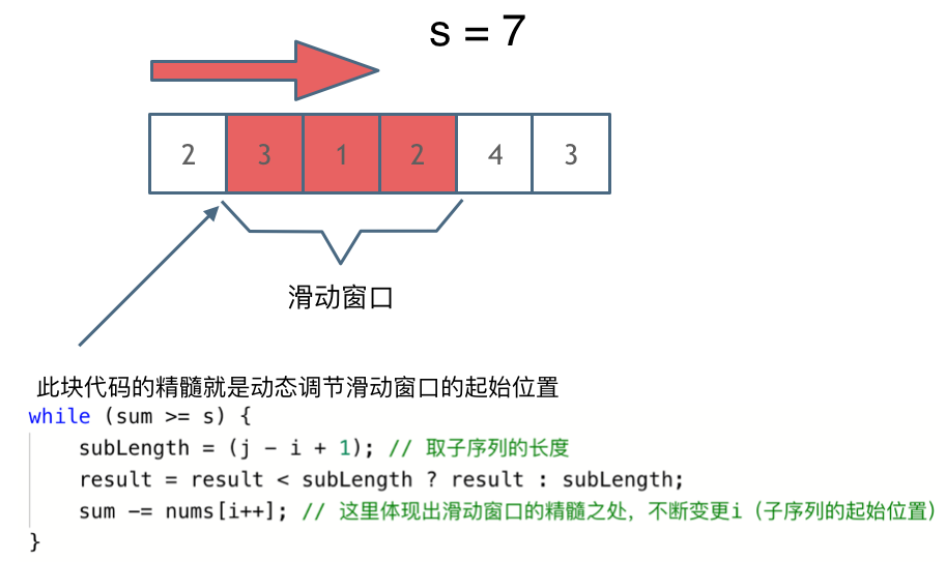
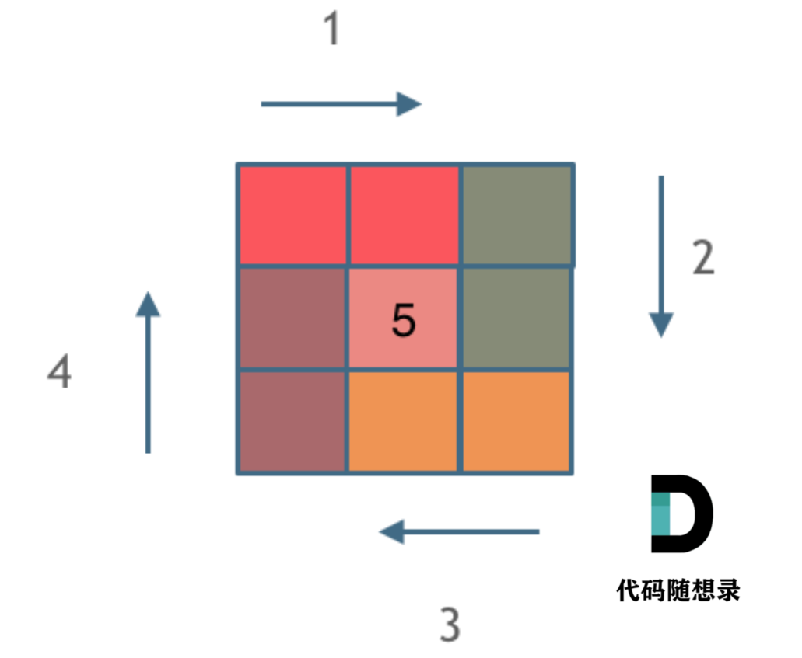
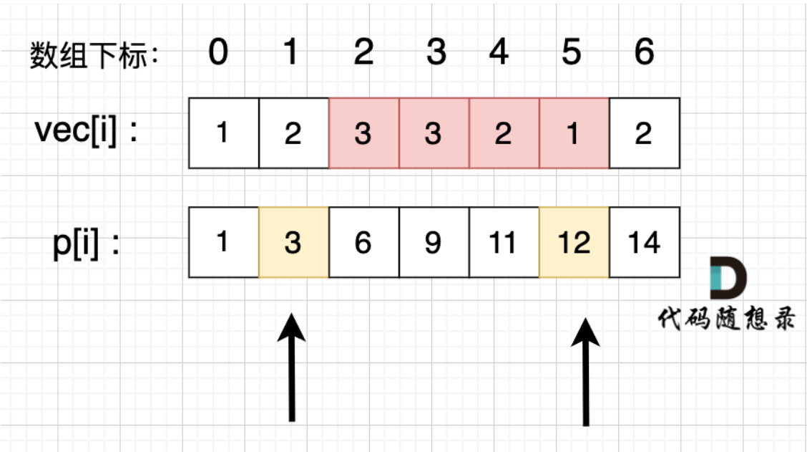

# KamaCamp Day2


## 209. [Minimum Size Subarray Sum](https://leetcode.cn/problems/minimum-size-subarray-sum/)

暴力解法：

两个for循环，然后不断的寻找符合条件的子序列。

一个for循环滑动窗口的起始位置，一个for循环为滑动窗口的终止位置，用两个for循环 完成了一个不断搜索区间的过程。

- 时间复杂度：O(n^2)
- 空间复杂度：O(1)

### 滑动窗口法

**滑动窗口，就是不断的调节子序列的起始位置和终止位置，从而得出我们想要的结果。**

首先要思考：如果用一个for循环，那么应该表示滑动窗口的起始位置，还是终止位置？

如果只用一个for循环来表示 滑动窗口的起始位置，那么如何遍历剩下的终止位置？**→ **暴力解法

**所以只用一个for循环，那么这个循环的索引，一定是表示滑动窗口的终止位置。**

在本题中实现滑动窗口，主要确定如下三点：

- **窗口内是什么？**

  窗口就是 满足其和 ≥ s 的长度最小的 连续 子数组。

- **如何移动窗口的起始位置？**

  如果当前窗口的值大于等于s了，窗口就要向前移动了（也就是该缩小了）。

- **如何移动窗口的结束位置？**

  窗口的结束位置就是遍历数组的指针，也就是for循环里的索引。



**滑动窗口的精妙之处在于根据当前子序列和大小的情况，不断调节子序列的起始位置。**从而将O(n^2)暴力解法降为O(n)。

> [!CAUTION]
>
> 注意局部变量需要初始化。

```cpp
class Solution {
public:
    int minSubArrayLen(int s, vector<int>& nums) {
        int result = INT32_MAX;
        int sum = 0; // 滑动窗口数值之和
        int i = 0; // 滑动窗口起始位置
        int subLength = 0; // 滑动窗口的长度
        for (int j = 0; j < nums.size(); j++) {
            sum += nums[j];
            // 注意这里使用while，每次更新 i（起始位置），并不断比较子序列是否符合条件
            while (sum >= s) {
                subLength = (j - i + 1); // 取子序列的长度
                result = result < subLength ? result : subLength;
                sum -= nums[i++]; // 这里体现出滑动窗口的精髓之处，不断变更i（子序列的起始位置）
            }
        }
        // 如果result没有被赋值的话，就返回0，说明没有符合条件的子序列
        return result == INT32_MAX ? 0 : result;
    }
};
```

- 时间复杂度：O(n)

  不要以为for里放一个while就以为是O(n^2)啊， 主要是看每一个元素被操作的次数，每个元素在滑动窗后进来操作一次，出去操作一次，每个元素都是被操作两次，所以时间复杂度是 2 × n 也就是O(n)。

- 空间复杂度：O(1)

> [!NOTE]
>
> **for循环和while循环：**
>
> for循环：
>
> - 已知循环次数的情况；需要计数器变量的场景；遍历数组或容器。
> - for循环中的初始化变量作用域仅限于循环内
>
> while循环：
>
> - 循环次数不确定的情况；基于条件判断的循环；需要更灵活控制的场景。
> - while循环需要在外部声明变量
>
> **if条件判断和while循环：**
>
> if条件判断：条件判断语句，根据条件执行一次代码块
>
> - 根据条件选择不同的执行路径；一次性的条件判断；数据验证和错误处理
>
> while循环：循环语句，只要条件为真就重复执行代码块
>
> - 重复执行某个操作；循环处理数据；等待某个条件满足


## 59.  [Spiral Matrix II](https://leetcode.cn/problems/spiral-matrix-ii/)

不涉及到什么算法，就是模拟过程。

求解本题要坚持**循环不变量原则**。

模拟顺时针画矩阵的过程:

- 填充上行从左到右
- 填充右列从上到下
- 填充下行从右到左
- 填充左列从下到上

由外向内一圈一圈这么画下去。每画一条边都要坚持一致的左闭右开，或者左开右闭的原则，这样这一圈才能按照统一的规则画下来。



```cpp
class Solution {
public:
    vector<vector<int>> generateMatrix(int n) {
        vector<vector<int>> res(n, vector<int>(n, 0)); // 使用vector定义一个二维数组
        int startx = 0, starty = 0; // 定义每循环一个圈的起始位置
        int loop = n / 2; // 每个圈循环几次，例如n为奇数3，那么loop = 1 只是循环一圈，矩阵中间的值需要单独处理
        int mid = n / 2; // 矩阵中间的位置，例如：n为3， 中间的位置就是(1，1)，n为5，中间位置为(2, 2)
        int count = 1; // 用来给矩阵中每一个空格赋值
        int offset = 1; // 需要控制每一条边遍历的长度，每次循环右边界收缩一位
        int i,j;
        while (loop --) {
            i = startx;
            j = starty;

            // 下面开始的四个for就是模拟转了一圈
            // 模拟填充上行从左到右(左闭右开)
            for (j; j < n - offset; j++) {
                res[i][j] = count++;
            }
            // 模拟填充右列从上到下(左闭右开)
            for (i; i < n - offset; i++) {
                res[i][j] = count++;
            }
            // 模拟填充下行从右到左(左闭右开)
            for (; j > starty; j--) {
                res[i][j] = count++;
            }
            // 模拟填充左列从下到上(左闭右开)
            for (; i > startx; i--) {
                res[i][j] = count++;
            }

            // 第二圈开始的时候，起始位置要各自加1， 例如：第一圈起始位置是(0, 0)，第二圈起始位置是(1, 1)
            startx++;
            starty++;

            // offset 控制每一圈里每一条边遍历的长度
            offset += 1;
        }

        // 如果n为奇数的话，需要单独给矩阵最中间的位置赋值
        if (n % 2) {
            res[mid][mid] = count;
        }
        return res;
    }
};
```

- 时间复杂度 O(n^2): 模拟遍历二维矩阵的时间
- 空间复杂度 O(1）

> [!CAUTION]
>
> 这里的startx、starty并不等同于二维坐标系中的横纵坐标。而是相当于二维数组中的第一个索引（表示行数）和第二个索引（表示列数）


## 58. 区间和

暴力解法：

给一个区间，然后 把这个区间的和都累加一遍不就得了，是一道简单不能再简单的题目。

如果我查询m次，每次查询的范围都是从0 到 n - 1。那么该算法的时间复杂度是 O(n * m) m 是查询的次数

### 前缀和

**前缀和**的思想是重复利用计算过的子数组之和，从而降低区间查询需要累加计算的次数。

我们要统计 **vec[i]** 这个数组上的区间和。我们先做累加，**即 p[i]表示 下标 0 到 i 的 vec[i] 累加 之和。**



> [!CAUTION]
>
>  在使用前缀和求解的时候，要特别注意 **求解区间**。
>
> 如上图，如果我们要求 区间下标 [2, 5] 的区间和，那么应该是 p[5] - p[1]，而不是 p[5] - p[2]。

```cpp
#include <iostream>
#include <vector>
using namespace std;
int main() {
    int n, a, b;
    cin >> n;
    vector<int> vec(n);	 //建立长度为n的整型动态数组
    vector<int> p(n);
    int presum = 0;
    for (int i = 0; i < n; i++) {
        cin >> vec[i];  	//scanf("%d", &vec[i]);
        presum += vec[i];
        p[i] = presum;
    }

    while (cin >> a >> b) {	 //while (~scanf("%d%d", &a, &b)) {
        int sum;
        if (a == 0) sum = p[b];
        else sum = p[b] - p[a - 1];
        cout << sum << endl; //printf("%d\n", sum);
    }
}
```

与暴力解法相比，除了p[i]的引入，还通过presum作为中介赋值p[i]。

> [!CAUTION]
>
> 注意 `if (a == 0) sum = p[b];`的情况
>
> 注意判断语句要使用 == 而非 = 


## 44. 开发商购买土地

暴力解法：

一个 for 枚举分割线， 嵌套 两个for 去累加区间里的和。

应该是 n^3 的时间复杂度。

### 前缀和

先将 行方向，和 列方向的和求出来，这样可以方便知道 划分的两个区间的和。

```cpp
#include <iostream>
#include <vector>
#include <climits>

using namespace std;
int main () {
    int n, m;
    cin >> n >> m;
    int sum = 0;
    vector<vector<int>> vec(n, vector<int>(m, 0)) ;
    for (int i = 0; i < n; i++) {
        for (int j = 0; j < m; j++) {
            cin >> vec[i][j];
            sum += vec[i][j];
        }
    }
```


```cpp
// 统计横向
    vector<int> horizontal(n, 0);
    for (int i = 0; i < n; i++) {
        for (int j = 0 ; j < m; j++) {
            horizontal[i] += vec[i][j];
        }
    }
    // 统计纵向
    vector<int> vertical(m , 0);
    for (int j = 0; j < m; j++) {
        for (int i = 0 ; i < n; i++) {
            vertical[j] += vec[i][j];
        }
    }
```


```cpp
int result = INT_MAX;

    int horizontalCut = 0;
    for (int i = 0 ; i < n; i++) {
        horizontalCut += horizontal[i];
        result = min(result, abs(sum - horizontalCut - horizontalCut));
    }

    int verticalCut = 0;
    for (int j = 0; j < m; j++) {
        verticalCut += vertical[j];
        result = min(result, abs(sum - verticalCut - verticalCut));
    }

    cout << result << endl;

}
```

- 时间复杂度： O(n^2)

其实本题可以在暴力求解的基础上，优化一下，就不用前缀和了，在行向遍历的时候，遇到行末尾就统一一下， 在列向遍历的时候，遇到列末尾就统计一下。时间复杂度也是 O(n^2)。

```cpp
int result = INT_MAX;
    int count = 0; 
   // 统计遍历过的行
    for (int i = 0; i < n; i++) {
        for (int j = 0 ; j < m; j++) {
            count += vec[i][j];
            // 遍历到行末尾时候开始统计
            if (j == m - 1) result = min (result, abs(sum - count - count));
        }
    }

    count = 0; 
    /*统计遍历过的列*/
    cout << result << endl;
```


> [!NOTE]
>
> **时间复杂度（Time Complexity）：**描述**算法执行时间随输入规模增长**的变化趋势。
>
> **空间复杂度（Space Complexity）：**描述**算法所需额外存储空间随输入规模增长**的变化趋势。