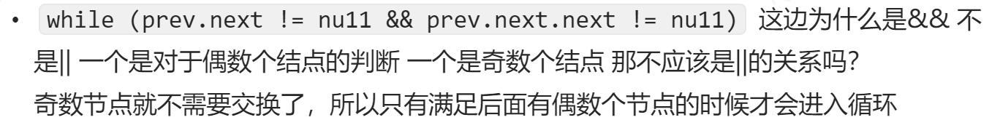
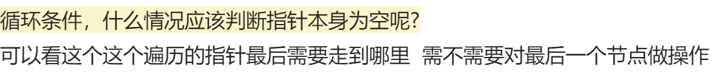
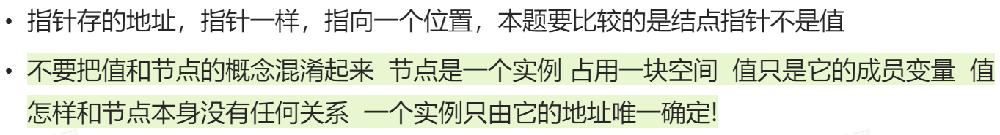
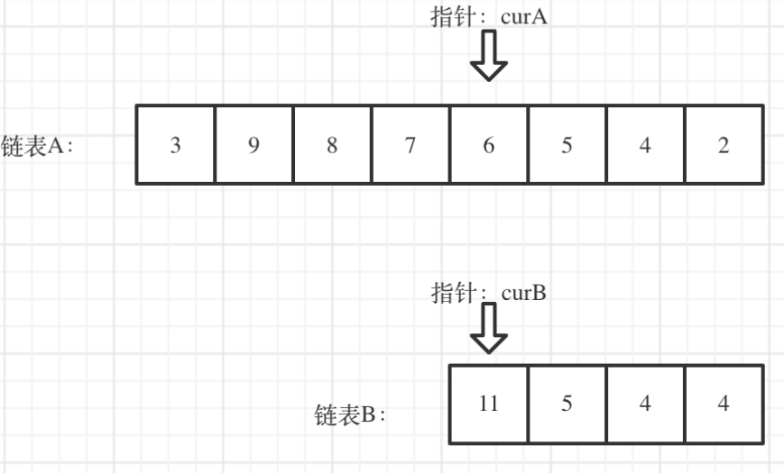
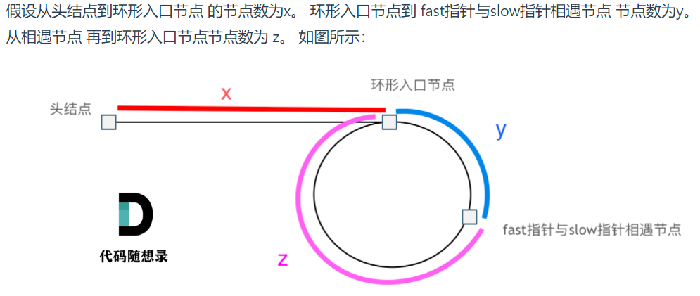
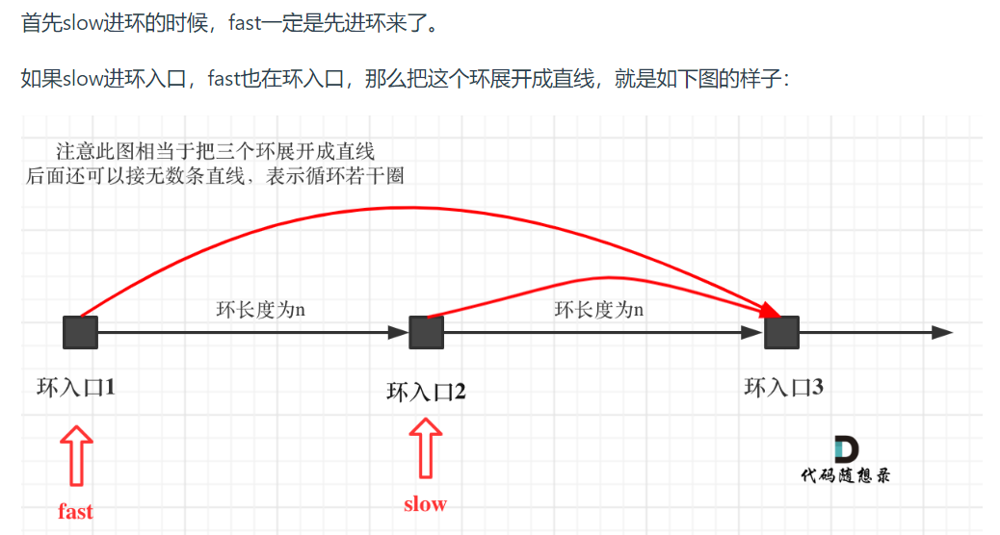

# KamaCamp Day4


## [24. Swap Nodes in Pairs](https://leetcode.cn/problems/swap-nodes-in-pairs/)

这道题**建议画图**来明确操作的先后顺序


使用**虚拟头结点**，否则每次需要针对头结点进行单独处理

```cpp
ListNode* dummyHead = new ListNode(0); // 设置一个虚拟头结点
dummyHead->next = head; // 将虚拟头结点指向head，这样方便后面做删除操作
```

使用**cur指针**来进行主要的操作。

使用**temp指针**来暂时保存节点。

```cpp
ListNode* cur = DummyHead;
while (cur->next != nullptr && cur->next->next != nullptr) {
    ListNode* temp1 = cur->next;
    ListNode* temp2 = cur->next->next->next;
```

> [!CAUTION]
>
> 
>
> 

最后需要将结果传到**result指针**中再删除虚拟头

```cpp
ListNode* result = DummyHead->next;
return result;
```


## [19. Remove Nth Node From End of List](https://leetcode.cn/problems/remove-nth-node-from-end-of-list/)

### 双指针法

如果要删除倒数第n个节点，让fast移动n步，然后让fast和slow同时移动，直到fast指向链表末尾。删掉slow所指向的节点就可以了。

**步骤如下：**

- 定义fast指针和slow指针，初始值为虚拟头结点

```cpp
 ListNode* dummyHead = new ListNode(0);
 dummyHead->next = head;
 ListNode* slow = dummyHead;
 ListNode* fast = dummyHead;
```

- **fast首先走n + 1步** ，为什么是n+1呢，因为只有这样同时移动的时候slow才能指向删除节点的上一个节点（方便做删除下一个节点的操作）

```cpp
while(n-- && fast != NULL) {
    fast = fast->next;
}
fast = fast->next; // fast再提前走一步，因为需要让slow指向删除节点的上一个节点
```

- fast和slow同时移动

```cpp
 while (fast != NULL) {
    fast = fast->next;
    slow = slow->next;
}
```

- 删除slow指向的下一个节点

```cpp
slow->next = slow->next->next; 
```

- 最后返回链表

```cpp
return dummyHead->next;
```

> [!NOTE]
>
> 

## [面试题 02.07. Intersection of Two Linked Lists LCCI](https://leetcode.cn/problems/intersection-of-two-linked-lists-lcci/)

求两个链表交点节点的**指针**。 这里同学们要注意，交点不是数值相等，而是指针相等。

为了方便举例，假设节点元素数值相等，则节点指针相等。

> [!CAUTION]
>
> 

我们求出两个链表的长度，

```cpp
ListNode* curA = headA;
    ListNode* curB = headB;
    int lenA = 0, lenB = 0;
    while (curA != NULL) { // 求链表A的长度
        lenA++;
        curA = curA->next;
    }
    while (curB != NULL) { // 求链表B的长度
        lenB++;
        curB = curB->next;
    }
    curA = headA;
    curB = headB;
```

```cpp
 // 让curA为最长链表的头，lenA为其长度
    if (lenB > lenA) {
        swap (lenA, lenB);
        swap (curA, curB);
    }
```

这样做可以**避免需要分类讨论**的情况。

并求出两个链表长度的差值，

```cpp
 // 求长度差
    int gap = lenA - lenB;
```

然后让curA移动到，和curB **末尾对齐**的位置。

```cpp
// 让curA和curB在同一起点上（末尾位置对齐）
while (gap--) {
    curA = curA->next;
}
```



此时我们就可以比较curA和curB是否相同，如果不相同，同时向后移动curA和curB，如果遇到curA == curB，则找到交点。

```cpp
// 遍历curA 和 curB，遇到相同则直接返回
    while (curA != NULL) {
        if (curA == curB) {
            return curA;
        }
        curA = curA->next;
        curB = curB->next;
    }
    
```


否则循环退出返回空指针。

```cpp
return NULL;
```


## [142. Linked List Cycle II](https://leetcode.cn/problems/linked-list-cycle-ii/)

**主要考察两知识点：**

1. 判断链表是否环
2. 如果有环，如何找到这个环的入口


- ### 判断链表是否有环

**快慢指针法**，分别定义 fast 和 slow 指针，从头结点出发，fast指针每次移动两个节点，slow指针每次移动一个节点，如果 fast 和 slow指针在途中相遇 ，说明这个链表有环。

```cpp
ListNode *detectCycle(ListNode *head) {
    ListNode* fast = head;
    ListNode* slow = head;
    while(fast != NULL && fast->next != NULL) {
        slow = slow->next;
        fast = fast->next->next;
```

为什么fast 走两个节点，slow走一个节点，有环的话，一定会在环内相遇呢，而不是永远的错开呢

**因为fast指针一定先进入环中，如果fast指针和slow指针相遇的话，一定是在环中相遇，这是毋庸置疑的。**

**其实相对于slow来说，fast是一个节点一个节点的靠近slow的**

- ### 如果有环，如何找到这个环的入口



相遇时， slow指针走过的节点数为: `x + y`， fast指针走过的节点数：`x + y + n (y + z)`

n为fast指针在环内走了n圈才遇到slow指针，（y+z）为 一圈内节点的个数A。

因为fast指针是一步走两个节点，slow指针一步走一个节点， 所以 fast指针走过的节点数 = slow指针走过的节点数 * 2：`(x + y) * 2 = x + y + n (y + z)`

两边消掉一个（x+y）: `x + y = n (y + z)`


因为要找环形的入口，那么要求的是**x**，因为x表示 头结点到 环形入口节点的的距离。

所以将x单独放在左面：`x = n (y + z) - y` ,

再从n(y+z)中提出一个（y+z）来，整理公式之后为如下公式：`x = (n - 1) (y + z) + z` 注意这里n一定是大于等于1的，因为 fast指针至少要多走一圈才能相遇slow指针。

这个公式说明什么呢？

先拿n为1的情况来举例，意味着fast指针在环形里转了一圈之后，就遇到了 slow指针了。

当 n为1的时候，公式就化解为 `x = z`，**即从头结点出发一个指针，从相遇节点 也出发一个指针，这两个指针每次只走一个节点， 那么当这两个指针相遇的时候就是 环形入口的节点**。

也就是在相遇节点处，定义一个指针index1，在头结点处定一个指针index2。

让index1和index2同时移动，每次移动一个节点， 那么他们相遇的地方就是 环形入口的节点。

```cpp
// 快慢指针相遇，此时从head 和 相遇点，同时查找直至相遇
if (slow == fast) {
    ListNode* index1 = fast;
    ListNode* index2 = head;
    while (index1 != index2) {
        index1 = index1->next;
        index2 = index2->next;
    }
    return index2; // 返回环的入口
}
```

注意ListNode* index1 = head;和后续使用index1的层次关系，否则会使index1未定义。

那么 n如果大于1是什么情况呢，就是fast指针在环形转n圈之后才遇到 slow指针。其实这种情况和n为1的时候 效果是一样的。

> [!CAUTION]
>
> **为什么第一次在环中相遇，slow的 步数 是 x+y 而不是 x + 若干环的长度 + y 呢？**
>
> 